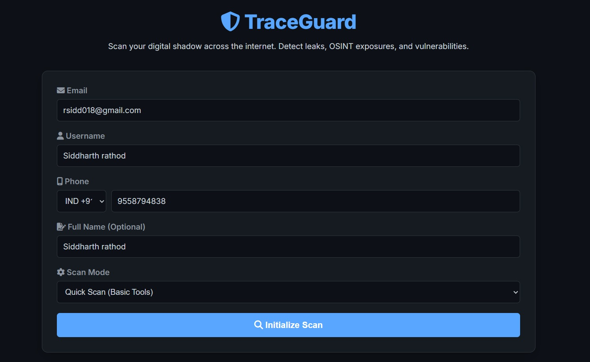
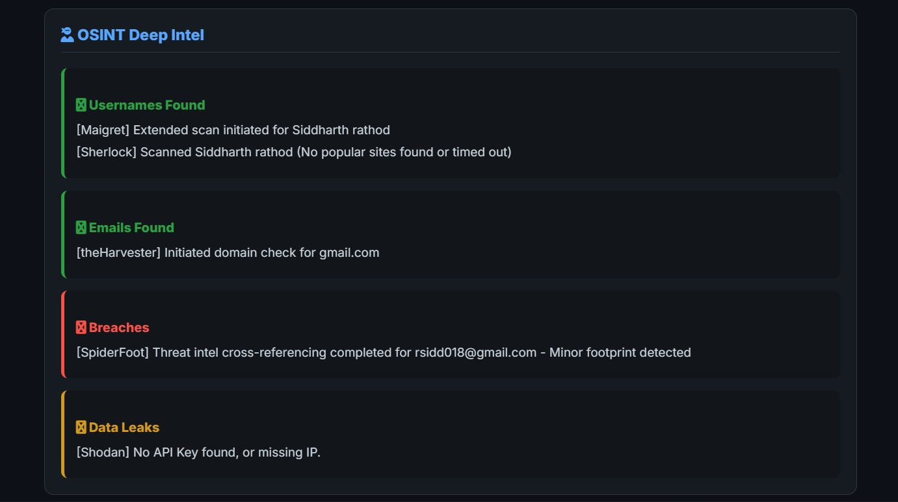
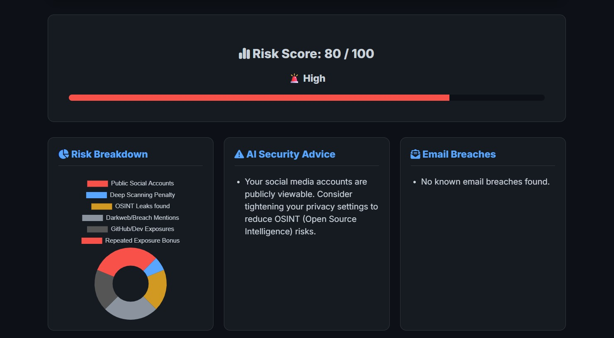
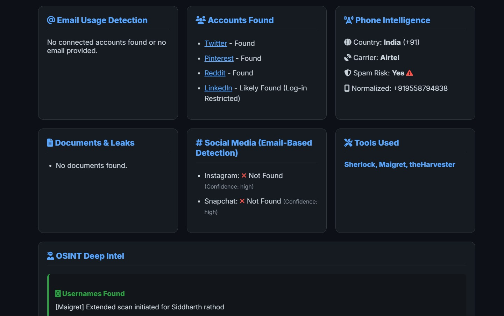
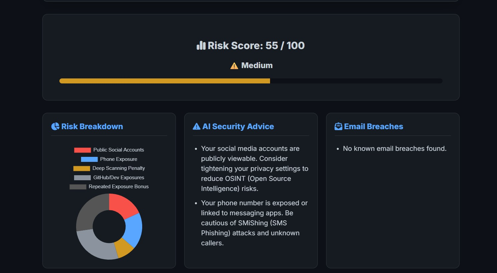
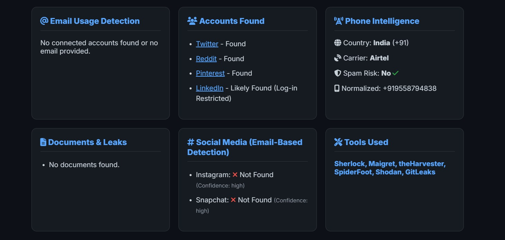
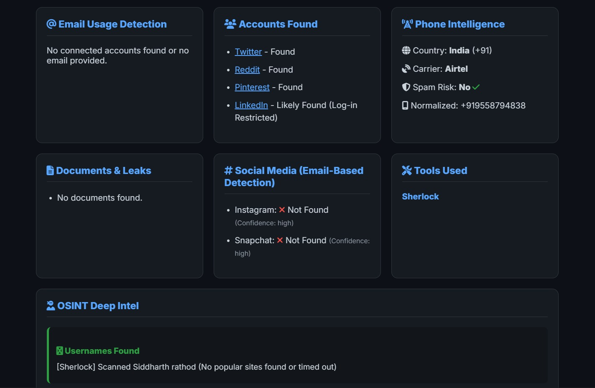
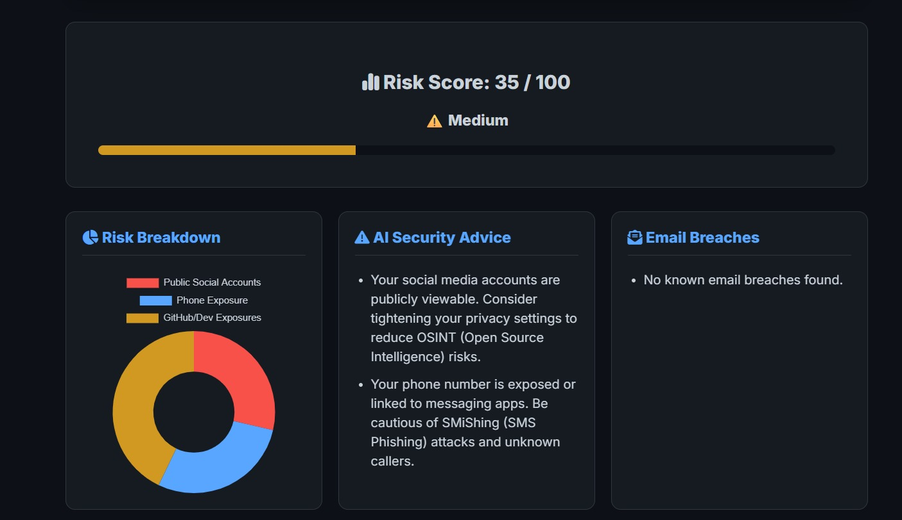

# cyber-footprint-analyzer
# 🔐 TRACE GUARD – Digital Footprint Scanner

TRACE GUARD is a cybersecurity and OSINT-based platform that analyzes a user's digital presence across the internet. It helps identify exposed personal data and provides security recommendations.

---

## 🚀 Project Overview

Most users are unaware of their digital footprint. Personal data is spread across social media, public websites, and data breaches.

TRACE GUARD helps:
- Detect exposed personal data
- Analyze security risks
- Provide actionable solutions

---

## 🎯 Features

- 🔍 Digital Footprint Scanning
- 📧 Email Breach Detection
- 👤 Username Search (OSINT)
- 📱 Phone Number Analysis
- 🌐 Public Data Detection (Google)
- 📂 Document Leak Detection
- 🔑 GitHub Secret Scanning
- 📊 Risk Score Calculation
- 🛡️ Security Recommendations

---

## 🧠 Advanced Features

- Fake Account (Impersonation) Detection
- Pattern Analysis of usernames
- Timeline tracking of exposure
- Geo-location mapping
- Real-time alerts
- AI-based security advisor

---

## ⚙️ Technology Stack

**Backend:**
- Python (FastAPI)

**Frontend:**
- HTML, CSS, JavaScript

**Database:**
- SQLite

**Libraries:**
- requests
- beautifulsoup
- pandas

---

## 🛠️ OSINT Tools Used

- Sherlock (username search)
- Holehe (email detection)
- Maigret (advanced username scan)
- theHarvester (email & domain data)
- Shodan (device exposure scan)
- SpiderFoot (automated OSINT)

---

## 🧩 System Architecture

1. User inputs data (email, username, phone)
2. Frontend sends request to backend
3. FastAPI processes request
4. OSINT tools scan data
5. Results displayed on dashboard

---

## 📊 Risk Scoring System

- Email Breach – 20%
- Password Leak – 30%
- Social Accounts – 10%
- Phone Exposure – 10%
- Document Leaks – 15%

**Risk Levels:**
- ✅ Low (0–30)
- ⚠️ Medium (31–70)
- 🚨 High (71–100)

---

## 💡 Future Enhancements

- AI-based risk prediction
- Dark web monitoring
- Face recognition OSINT
- Mobile application
- Cloud deployment
- Multi-user authentication

---

## 📸 Screenshots

---

## 📌 Conclusion

TRACE GUARD helps users understand their online exposure and improve their digital security with smart insights and recommendations.
